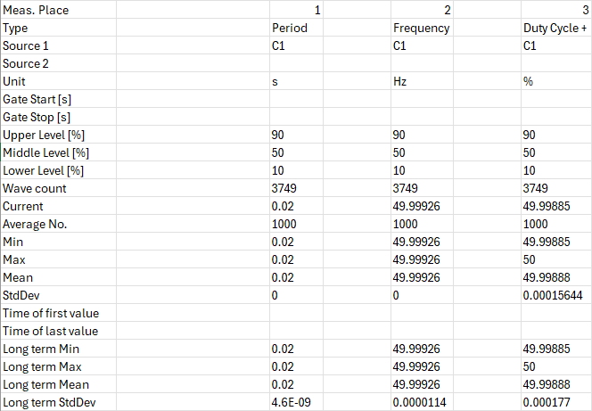
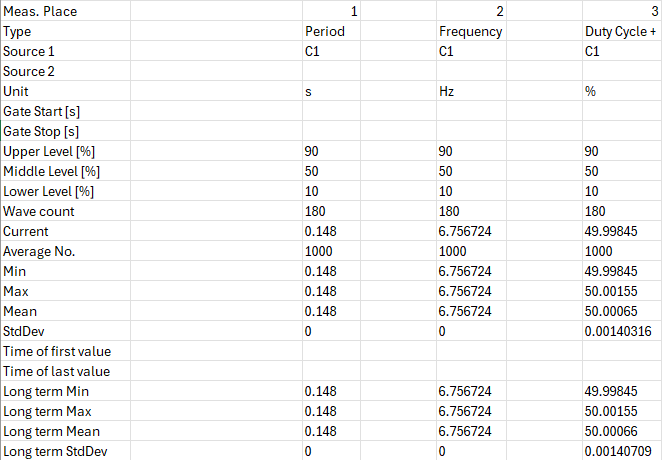
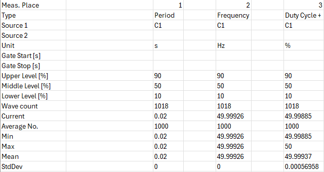
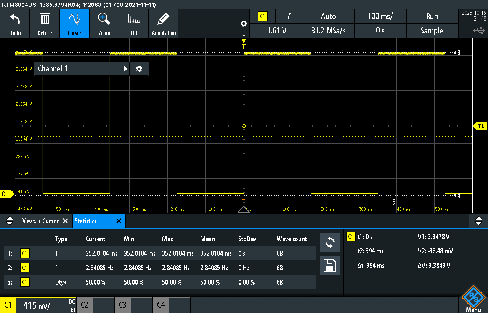
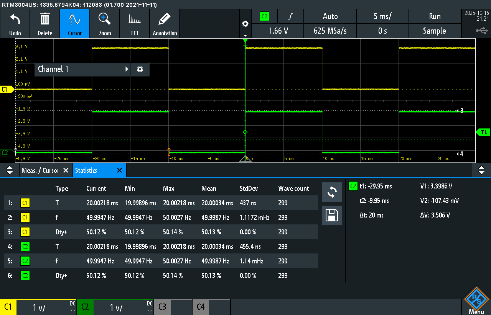
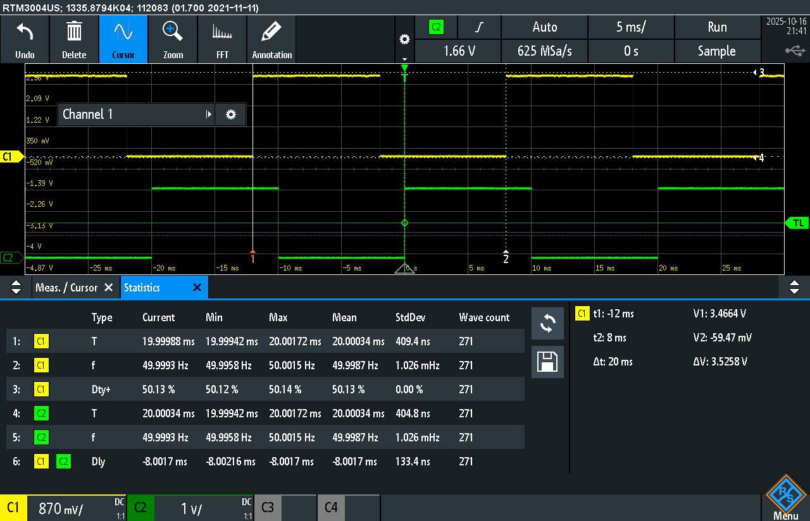

# Jitter and Drift Measurements

## Approach to Calculations

Jitter was calculated as how much the measured signal’s period differed from the ideal period.

Drift was found by looking at how much that difference would add up over an hour.  
Basically, we compared how many periods should happen per hour (ideal) versus how many actually did (measured), and then turned that into a percentage showing how much faster or slower the signal ran.

- **Ideal period:** 20 ms (used for all tests)
- **Activity 1:** No-op for loop with **2 million iterations**
- **Activity 2:** No-op for loop with **200 thousand iterations**
- **Data collection:** We used the oscilloscope’s built-in stats feature and exported the data as `.csv` and `.png` files to analyze later.

Some really tiny non-zero values were rounded or cut off to zero. Those are shown as “~0”.

---

## Results

### task_delay (no busy loop)

#### Note: We did not collect images for this, our numbers were taken from the oscilloscope though and were extremely similar to sleep.c 's measurements
- **Jitter:** ~0 ms  
- **Drift:** 0.0017% slower  

### task_delay (with busy loop)
- **Jitter:** 128.0004 ms  
- **Drift:** 86.5% slower  

---

### sleep (no busy loop)
- **Jitter:** ~0 ms  
- **Drift:** 0.0017% slower  

### sleep (with busy loop)
- **Jitter:** 128.0004 ms  
- **Drift:** 86.5% slower  

---

### timer (no busy loop)
- **Jitter:** ~0 ms  
- **Drift:** 0.0017% slower  

---

### timer (with busy loop)
- **Jitter:** 332.0104 ms  
- **Drift:** 94.32% slower  

---

### gpio_interrupt (no busy loop)
- The delay between the sync signal and the board output was basically zero (~0 ms).

---

### gpio_interrupt (with busy loop)
#### Note: see the `Dly` statistic for our delay measurement from the oscilloscope

- **Delay:** ~8 ms  

